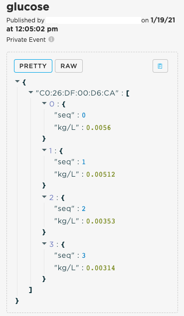

# Glucose Meter example

This example shows how to use a Boron to connect to a Glucose Meter that implements the standard 
[Glucose Profile](https://www.bluetooth.org/docman/handlers/downloaddoc.ashx?doc_id=248025).

The application was tested with the [TN'G Voice Glucose Meter](https://foracare.com/diabetes-care/fora-tng-voice-fora-blood-glucose-meters-for-diabetes-care/).

## Usage

Since getting the measurements is done in a blocking manner, there isn't a need to register any
callbacks in this application. Instead, all the functionality is in the `loop()`, after enabling
the Glucose Meter service in `setup()`:

```c++
void setup() {
  // Enable Glucose Monitor
  BleDeviceGateway::instance().enableService(GlucoseMeter::bleDevicePtr, BLE_SIG_UUID_GLUCOSE_SVC);
}
```

The example then checks if we are connected to a Glucose Meter, and if so, it gets the number of stored
records with `getNumberStoredRecords()`. If it's less than five, then it gets all measurements. If more
than five, it gets the last five, using `getMeasurements()`.

That call returns a `Vector<GlucoseMeter::Measurement>`, and the application creates a JSON object
which is then sent to the cloud with `Particle.publish()`. The result can be viewed on the Console
event stream, or use a Webhook to send it to any server with a REST API. Here's an example of the 
Console event stream JSON:



## Glucose Meter

The Glucose Meter collects specimen measurements without necessarily being connected via Bluetooth.
Rather than reporting real-time information (like a Heart Rate Monitor, or Cycling Speed Sensor), it
stores the measurement information on the device itself until a connection is made, and then the Central
device downloads the data. 

Due to this type of usage, this Library uses the callback function only for real time information, 
such as information from the Battery Service (if the Glucose Meter implements that).

For retrieving the measurements stored on the device, the Library implements blocking functions
that the application can use. The full list is in the `peripherals/glucose-meter.h` file. Some of
the more common usage follows.

To get the number of records that the Glucose Meter has, the application can call:

```c++
int getNumberStoredRecords(uint16_t timeout_ms = 5000);
```

To get a `Vector` of the measurements, the application can call one of the `getMeasurements` functions.
In the list below: 
* The first returns all the available measurements.
* The second returns either greater than or less than a specific sequence number
* The third returns measurements in between specific sequence numbers

Note that supporting less than or in between is optional in the Bluetooth specification.

```c++
Vector<Measurement>& getMeasurements(uint16_t timeout_ms = 5000);
Vector<Measurement>& getMeasurements(RecordAccessControlPoint::Operator oper, uint16_t min, uint16_t timeout_ms = 5000);
Vector<Measurement>& getMeasurements(uint16_t min, uint16_t max, uint16_t timeout_ms = 5000);
```