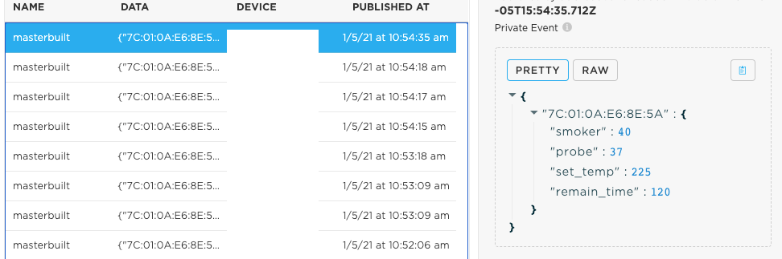

# Masterbuilt Smoker

This example shows how to use a Boron to connect to a Masterbuilt-brand electric smoker, which uses a
custom service UUID. This example also shows how to handle passkey pairing if that's necessary.

This application has been tested with the following smoker:
[Masterbuilt smoker](https://www.masterbuilt.com/products/40-inch-bluetooth-digital-electric-smoker)

## Usage

### Publish temperature and remaining time

The Masterbuilt electric smoker sends the current status over BLE once per second. The application
can choose to receive every update, or only when there's a chance in the temperature. For this example, 
it is set to only when there is a change, by setting the callback when there's a new connection.

In the `onConnect` callback, the third parameter in `setNewValueCallback` indicates whether to only
call when there's changed value.
```c++
  if (device.getType() == BleUuid(MASTERBUILT_SMOKER_SERVICE)) {
    MasterbuiltSmoker& dev = (MasterbuiltSmoker&)device;
    dev.setNewValueCallback(onChangedSmokerValue, NULL, true);
  } 
```

That callback just sets a flag for the `loop()` to publish:
```c++
void onChangedSmokerValue(MasterbuiltSmoker& smoker, void* context) {
  // This callback executes on the BLE thread, so we need to avoid lengthy operations
  // such as Particle.publish().
  // https://docs.particle.io/reference/device-os/firmware/boron/#ondatareceived-
  publish = true;
}
```

And then in `loop()`, we gather the data from all the smokers the device is connected to, and
publish it as JSON. The result can be viewed on the console, as the following screenshot shows.
You can also create a Webhook to send to a cloud service to visualize the data.




### Changing the temperature and timer

One key aspect of this smoker is the ability to remotely change the temperature or the time to
keep the smoker on. This application uses a Particle function to do that:

```c++
Particle.function("setTempAndtime", setTempAndTime);
```

By making this a Particle function, it can be called from the console, as well as via the Particle
Cloud API, making it easy to integrate into your own WebApp or mobile App. The function itself
parses JSON, and then sends the command to the smoker to set the temperature and time.

For example, to set the temperature to 225F and the timer to 120 minutes, you would send this JSON
to the function:

`{"temp":225,"time":120}`

## Smoker information

The code included in `peripherals/masterbuilt-smoker.h` and `peripherals/masterbuilt-smoker.cpp` works with
the following smoker made by Masterbuilt:


The code handles the connectivity to the smoker, as well as storing the current status of the smoker and exposing
APIs to change the temperature and timer.

### Current status

The smoker sends its current status once per second. The code stores that, and exposes APIs to retrieve the
different parameters. Note that this smoker has two different temperatures, one for the probe that goes into
the meat, and the other for the smoker itself.

```c++
uint16_t getProbeTemp();
uint16_t getSmokerTemp();
uint16_t getSetTemp();
uint16_t getRemainingTime();
uint16_t getSetTime();
bool isPowerOn();
```

### Controlling temperature and timer

The smoker allows for the set temperature and the timer to be changed over BLE. The code handles the BLE
communication, and exposes APIs that the application can use to do that:

```c++
bool setTempAndTime(uint16_t temp, uint16_t minutes);
bool setSmokerTemp(uint16_t temp);
bool setSmokerTime(uint16_t minutes);
```