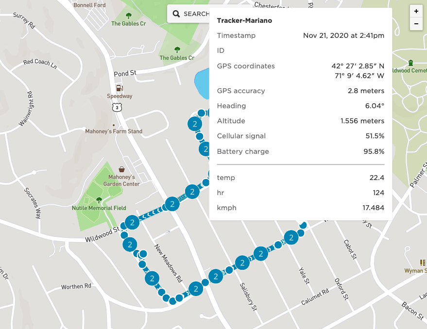

# Bicycle Speed and Heart Rate on Tracker

This example shows how to use a Tracker to connect to a Heart Rate monitor (HRM) and a Bicycle speed sensor (CSC).

## Associating data to location

Tracker Edge firmware will publish a location object that is stored by the Particle Tracker Services. Any data
included with the location publish will be associated with the location and stored so that it can later be
retrieved in the console or through the Cloud API.

This makes it very easy for this application to then display speed and heart rate at specific points on a bike
trip. In order to add the custom data to the publish, we register a callback that will be called when the
Tracker is getting ready to publish location:

`Tracker::instance().location.regLocGenCallback(loc_gen_cb);`

The callback will then use the `JSONWriter` that is passed to add the custom data.

## Data update period

Both the HRM and CSC will normally send new values once per second. It would be possible for each time 
that we receive new data to publish it. But instead, this application lets the user control how often
to publish with the built-in Configuration Service. Because the Configuration Service already has
an extensive way to configure publish intervals (based on time, radius, movement), there is no special
code that is needed in this application to make a decision on when to publish.

## Viewing the data

After a bike ride, you can go to the Particle Console and look for the current or historical information
of the Tracker on the map. Because we're adding the heart rate and speed to the location object, it will
be associated and displayed like this:

