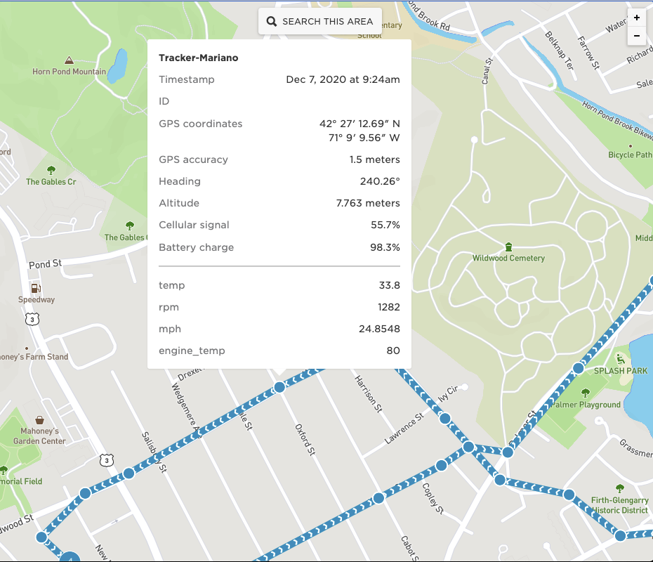

# Read OBD2 on Tracker with Veepeak OBDCheck BLE+

This example shows how to use a Tracker to connect to an OBD2 reader over BLE. The OBD reader is made
by Veepeak.


## OBD2 connection

The connection to the OBD2 port on the car is made with a device made by Veepeak called OBDCheck BLE+.
This device uses the very popular ELM327 command protocol to access the data from the CAN bus. There
are a number of devices out there that support ELM327 and might work with this library. At this time,
the only device tested is the aformentioned Veepeak. Find out more information about this device here:
[Veepeak OBDCheck BLE+ webpage](https://www.veepeak.com/product/obdcheck-ble-plus/)

## Usage

### Associating data to location

Tracker Edge firmware will publish a location object that is stored by the Particle Tracker Services. Any data
included with the location publish will be associated with the location and stored so that it can later be
retrieved in the console or through the Cloud API.

This makes it very easy for this application to then display the OBD2 parameters at specific points on a 
trip. In order to add the custom data to the publish, we register a callback that will be called when the
Tracker is getting ready to publish location:

`Tracker::instance().location.regLocGenCallback(loc_gen_cb);`

The callback will then use the `JSONWriter` that is passed to add the custom data.

### Viewing the data

After a drive, you can go to the Particle Console and look for the current or historical information
of the Tracker on the map. Because we're adding the engine parameters to the location object, it will
be associated and displayed like this:



The RPM, speed, and engine temperature are displayed for each published location. Since they are in the location
object, they are also stored to the database and can be retrieved via the Console or the Cloud API for analysis.

## ELM327

[ELM327](https://en.wikipedia.org/wiki/ELM327) command protocol is a popular way to access data from
the OBD2 port of vehicles. This simple protocol uses AT commands over a UART-like interface. There
are two components to getting the data from the BLE peripheral to the Particle Tracker: an emulated
serial port over BLE, and the ELM protocol itself.

### Emulate UART over BLE

The `veepeak-obdcheck.h/cpp` files in the `peripherals` directory of the BLE Gateway Library 
handle the BLE connectivity to the OBD2 device, and derive the 
[Stream Class](https://github.com/particle-iot/device-os/blob/develop/wiring/inc/spark_wiring_stream.h) 
in order to emulate a UART interface. There are a few functions to override, but let's primarily look
at `read` and `write`.

The `read` function is expected to return one byte, and the `write` function takes a byte to write 
into the stream. The Veepeak OBDCheck BLE+ device has two Characteristics in the BLE Service it uses
for exchanging data. The Service UUID is `0xFFF0`, which contains Characteristic with UUID `0xFFF1`
which will send a NOTIFY packet when it has data and Characteristic with UUID `0xFFF2` to write data to.

Just as if working with a UART, the code will receive the incoming data from the `0xFFF1` notification
into a receive buffer. The buffer size is by default 1024 bytes, but it can be adjusted in the header file:

```c++
#define VEEPEAK_INPUT_BUFFER_SIZE 1024
```

The `read()` function will return the first byte from that buffer.

The `write()` function is a little more involved. In a traditional UART, a write can just be sent
over the wire, or buffered and then use DMA to send larger amounts of data. Since BLE sends packets
between devices, it doesn't make sense to send one byte at a time. Instead, we buffer it and send
the whole packet either when receiving a newline character, or when the buffer is full. The write
buffer is set by default to 128 bytes, but can also be adjusted in the header file:

```c++
#define VEEPEAK_OUTPUT_BUFFER_SIZE 128
```

### ELM Library

Because of the popularity, there is a lot of code written to access the ELM327 protocol. In this case,
I forked ELMduino to make a couple of modifications to work with DeviceOS. The forked version can be 
found here:
https://github.com/mgolu/ELMduino

To use it clone the ELMduino library into the `lib` directory of your project, and then add it to your
code like this:

```c++
#include "ELMduino.h"

ELM327 myELM327;
``` 

The ELMduino library expects an object that derives the Stream class to send commands to and receive
responses from. Since we don't know when the Tracker will connect to a device, we don't put anything
in `setup()`. Instead, we wait for the `onConnect` callback, and there pass the `VeepeakObd` instance
to the ELMduino library:

```c++
void onConnect(BleDevice& device)
{
    // .
    // .
    // .
    if (device.getType() == BleUuid(VEEPEAK_SERVICE)) {
        VeepeakObd& dev = (VeepeakObd&)device;
        myELM327.begin(dev))
    } 
}
```